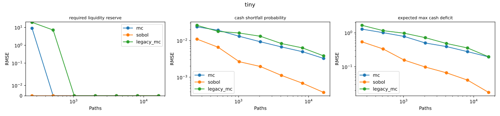
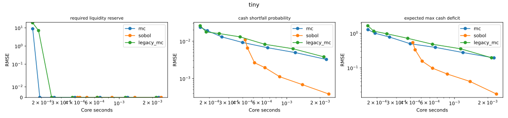
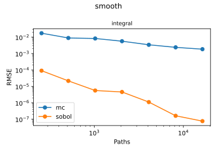
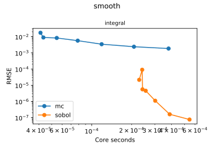
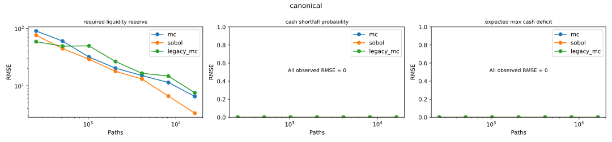
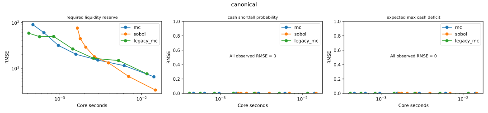
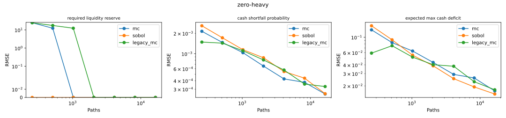
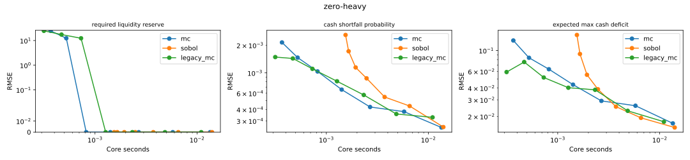
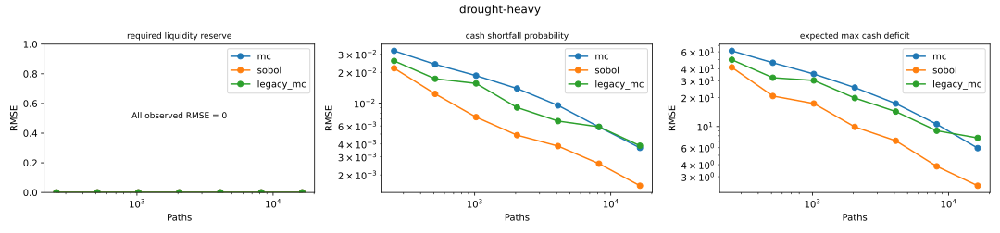
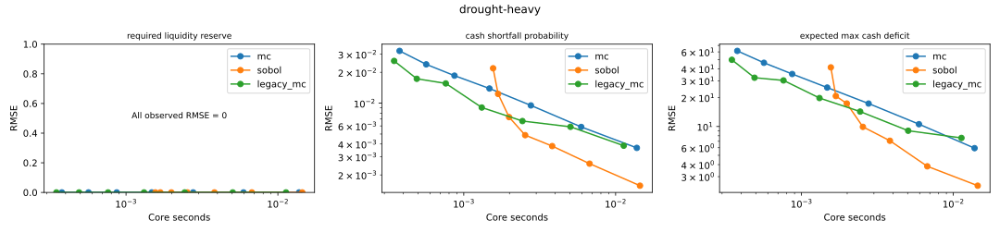

# Measured results (standard)

32 independent replicates; N=[256, 512, 1024, 2048, 4096, 8192, 16384]. Financial timings include the complete shared numerical core.

Errors for larger cases are relative to independent MC, not exact truth. No forecast-calibration claim follows.

| Case | Target | Method | N | RMSE | Median ms | Reference 95% half-width* |
|---|---|---|---:|---:|---:|---:|
| canonical | cash_shortfall_probability | legacy_mc | 16384 | 0 | 11.604 | 3.518e-06 |
| canonical | expected_max_cash_deficit | legacy_mc | 16384 | 0 | 11.604 | 0.013382 |
| canonical | required_liquidity_reserve | legacy_mc | 16384 | 7.52049 | 11.604 | 1.4712 |
| canonical | cash_shortfall_probability | mc | 16384 | 0 | 14.121 | 3.518e-06 |
| canonical | expected_max_cash_deficit | mc | 16384 | 0 | 14.121 | 0.013382 |
| canonical | required_liquidity_reserve | mc | 16384 | 6.48092 | 14.121 | 1.4712 |
| canonical | cash_shortfall_probability | sobol | 16384 | 0 | 14.704 | 3.518e-06 |
| canonical | expected_max_cash_deficit | sobol | 16384 | 0 | 14.704 | 0.013382 |
| canonical | required_liquidity_reserve | sobol | 16384 | 3.31754 | 14.704 | 1.4712 |
| drought-heavy | cash_shortfall_probability | legacy_mc | 16384 | 0.00385058 | 11.309 | 0.00094115 |
| drought-heavy | expected_max_cash_deficit | legacy_mc | 16384 | 7.59265 | 11.309 | 1.6907 |
| drought-heavy | required_liquidity_reserve | legacy_mc | 16384 | 0 | 11.309 | 0 |
| drought-heavy | cash_shortfall_probability | mc | 16384 | 0.00366506 | 13.792 | 0.00094115 |
| drought-heavy | expected_max_cash_deficit | mc | 16384 | 5.94078 | 13.792 | 1.6907 |
| drought-heavy | required_liquidity_reserve | mc | 16384 | 0 | 13.792 | 0 |
| drought-heavy | cash_shortfall_probability | sobol | 16384 | 0.0015692 | 14.470 | 0.00094115 |
| drought-heavy | expected_max_cash_deficit | sobol | 16384 | 2.41211 | 14.470 | 1.6907 |
| drought-heavy | required_liquidity_reserve | sobol | 16384 | 0 | 14.470 | 0 |
| smooth | integral | mc | 16384 | 0.00185352 | 0.380 | 0 |
| smooth | integral | sobol | 16384 | 7.64453e-08 | 0.546 | 0 |
| tiny | cash_shortfall_probability | legacy_mc | 16384 | 0.00380813 | 2.162 | 0 |
| tiny | expected_max_cash_deficit | legacy_mc | 16384 | 0.195934 | 2.162 | 0 |
| tiny | required_liquidity_reserve | legacy_mc | 16384 | 0 | 2.162 | 0 |
| tiny | cash_shortfall_probability | mc | 16384 | 0.00325069 | 2.277 | 0 |
| tiny | expected_max_cash_deficit | mc | 16384 | 0.194556 | 2.277 | 0 |
| tiny | required_liquidity_reserve | mc | 16384 | 0 | 2.277 | 0 |
| tiny | cash_shortfall_probability | sobol | 16384 | 0.000384556 | 2.395 | 0 |
| tiny | expected_max_cash_deficit | sobol | 16384 | 0.0174604 | 2.395 | 0 |
| tiny | required_liquidity_reserve | sobol | 16384 | 0 | 2.395 | 0 |
| zero-heavy | cash_shortfall_probability | legacy_mc | 16384 | 0.00032796 | 10.994 | 6.8681e-05 |
| zero-heavy | expected_max_cash_deficit | legacy_mc | 16384 | 0.0175436 | 10.994 | 0.0038528 |
| zero-heavy | required_liquidity_reserve | legacy_mc | 16384 | 0 | 10.994 | 0 |
| zero-heavy | cash_shortfall_probability | mc | 16384 | 0.000254259 | 13.440 | 6.8681e-05 |
| zero-heavy | expected_max_cash_deficit | mc | 16384 | 0.0168638 | 13.440 | 0.0038528 |
| zero-heavy | required_liquidity_reserve | mc | 16384 | 0 | 13.440 | 0 |
| zero-heavy | cash_shortfall_probability | sobol | 16384 | 0.000257077 | 14.019 | 6.8681e-05 |
| zero-heavy | expected_max_cash_deficit | sobol | 16384 | 0.0152432 | 14.019 | 0.0038528 |
| zero-heavy | required_liquidity_reserve | sobol | 16384 | 0 | 14.019 | 0 |

*Maximum distance from reference estimate to either interval endpoint.

## Cost at predefined error tolerances

Fastest observed eligible grid point; best of new and legacy MC is the ordinary baseline. Missing attainment means not reached on this grid. Reference uncertainty >= half the tolerance makes a comparison unresolved.

| Case | Target | Tolerance | Best ordinary | MC/Sobol cost ratio |
|---|---|---:|---|---:|
| canonical | cash_shortfall_probability | 0.005 | legacy_mc | 0.255 |
| canonical | expected_max_cash_deficit | 5 | legacy_mc | 0.255 |
| canonical | required_liquidity_reserve | 50 | legacy_mc | 0.318 |
| drought-heavy | cash_shortfall_probability | 0.005 | legacy_mc | unresolved reference |
| drought-heavy | expected_max_cash_deficit | 5 | not reached | not reached on this grid |
| drought-heavy | required_liquidity_reserve | 50 | legacy_mc | 0.223 |
| smooth | integral | 0.0001 | not reached | not reached on this grid |
| tiny | cash_shortfall_probability | 0.005 | mc | 2.336 |
| tiny | expected_max_cash_deficit | 0.5 | mc | 0.904 |
| tiny | required_liquidity_reserve | 5 | mc | 0.456 |
| zero-heavy | cash_shortfall_probability | 0.005 | legacy_mc | 0.205 |
| zero-heavy | expected_max_cash_deficit | 5 | legacy_mc | 0.205 |
| zero-heavy | required_liquidity_reserve | 50 | legacy_mc | 0.205 |

Ratios above one favor Sobol; below one favor ordinary MC. Zero RMSE on an atom is retained, without dividing by RMSE. These timings describe this machine and grid only.

The smooth integral is a four-dimensional positive control, not evidence for the financial model. Financial mapping contains discontinuities and atoms; no universal rate or speedup is asserted.

## Reference estimates and 95% intervals

| Case | Target | Reference | Interval |
|---|---|---:|---|
| smooth | integral | 1.66597618 | exact |
| tiny | required_liquidity_reserve | 90 | exact |
| tiny | cash_shortfall_probability | 0.390382608 | exact |
| tiny | expected_max_cash_deficit | 20.6885506 | exact |
| canonical | required_liquidity_reserve | 1351.76234 | [1350.2911645974489, 1352.654951640687] |
| canonical | cash_shortfall_probability | 0 | [0.0, 3.5179834035890408e-06] |
| canonical | expected_max_cash_deficit | 0 | [0.0, 0.013382464031105743] |
| zero-heavy | required_liquidity_reserve | 110 | [110.0, 110.0] |
| zero-heavy | cash_shortfall_probability | 0.00121974945 | [0.0011538475279102346, 0.0012884308413237426] |
| zero-heavy | expected_max_cash_deficit | 0.0592327118 | [0.055379877206703294, 0.06308554637728109] |
| drought-heavy | required_liquidity_reserve | 3900 | [3900.0, 3900.0] |
| drought-heavy | cash_shortfall_probability | 0.592721939 | [0.5917807930850856, 0.5936625728781966] |
| drought-heavy | expected_max_cash_deficit | 774.644547 | [772.9538570044655, 776.3352360131126] |

The raw aggregates also give the possible RMSE range when the reference varies within its interval; those ranges are reference sensitivity, not confidence intervals for replicate RMSE.

## Path diversity and deterministic events

Diagnostic MC sample uses the largest configured N, root seed, and replicate 0. Earliest minimum day breaks ties; full counts, path-minimum quantiles and settings are saved in diagnostics JSON.

| Case | Distinct index paths | Distinct reserves | Zero reserve mass | Zero deficit mass | Baseline reserve | With $100 later bill |
|---|---:|---:|---:|---:|---:|---:|
| tiny | 65 | 11 | 0.0568237 | 0.607788 | 90 | 180 |
| canonical | 15133 | 2781 | 0 | 1 | 1354.38 | 1404.27 |
| zero-heavy | 14354 | 6 | 0.864075 | 0.999084 | 110 | 110 |
| drought-heavy | 14614 | 61 | 0 | 0.406799 | 3900 | 4000 |

## Exact-case CDF around the reserve

A stable reserve can coexist with CDF error. The exact inverse CDF selects $90 once cumulative mass crosses 0.95; nearby CDF discrepancies are reported separately.

| Method | N | Reserve support | Exact CDF | CDF RMSE |
|---|---:|---:|---:|---:|
| mc | 16384 | 80 | 0.664543066 | 0.00350901 |
| mc | 16384 | 90 | 0.966238347 | 0.00122333 |
| mc | 16384 | 130 | 0.968325955 | 0.00120995 |
| sobol | 16384 | 80 | 0.664543066 | 0.000294489 |
| sobol | 16384 | 90 | 0.966238347 | 0.000352696 |
| sobol | 16384 | 130 | 0.968325955 | 0.000365221 |
| legacy_mc | 16384 | 80 | 0.664543066 | 0.00359858 |
| legacy_mc | 16384 | 90 | 0.966238347 | 0.00113968 |
| legacy_mc | 16384 | 130 | 0.968325955 | 0.00111257 |

## Selected costs

| Case | Target | Method | Selected N | Median seconds | Status |
|---|---|---|---:|---:|---|
| canonical | cash_shortfall_probability | legacy_mc | 256 | 0.000418296 | observed attainment |
| canonical | cash_shortfall_probability | mc | 256 | 0.000469261 | observed attainment |
| canonical | cash_shortfall_probability | sobol | 256 | 0.00163841 | observed attainment |
| canonical | expected_max_cash_deficit | legacy_mc | 256 | 0.000418296 | observed attainment |
| canonical | expected_max_cash_deficit | mc | 256 | 0.000469261 | observed attainment |
| canonical | expected_max_cash_deficit | sobol | 256 | 0.00163841 | observed attainment |
| canonical | required_liquidity_reserve | legacy_mc | 512 | 0.000565725 | observed attainment |
| canonical | required_liquidity_reserve | mc | 1024 | 0.000960268 | observed attainment |
| canonical | required_liquidity_reserve | sobol | 512 | 0.00177864 | observed attainment |
| drought-heavy | cash_shortfall_probability | legacy_mc | 16384 | 0.011309 | observed attainment |
| drought-heavy | cash_shortfall_probability | mc | 16384 | 0.0137922 | observed attainment |
| drought-heavy | cash_shortfall_probability | sobol | 2048 | 0.00253755 | observed attainment |
| drought-heavy | expected_max_cash_deficit | legacy_mc | — | — | not reached on this grid |
| drought-heavy | expected_max_cash_deficit | mc | — | — | not reached on this grid |
| drought-heavy | expected_max_cash_deficit | sobol | 8192 | 0.00673756 | observed attainment |
| drought-heavy | required_liquidity_reserve | legacy_mc | 256 | 0.000347908 | observed attainment |
| drought-heavy | required_liquidity_reserve | mc | 256 | 0.000377801 | observed attainment |
| drought-heavy | required_liquidity_reserve | sobol | 256 | 0.00156042 | observed attainment |
| smooth | integral | mc | — | — | not reached on this grid |
| smooth | integral | sobol | 512 | 0.000228059 | observed attainment |
| tiny | cash_shortfall_probability | legacy_mc | 16384 | 0.0021616 | observed attainment |
| tiny | cash_shortfall_probability | mc | 8192 | 0.00119445 | observed attainment |
| tiny | cash_shortfall_probability | sobol | 1024 | 0.000511378 | observed attainment |
| tiny | expected_max_cash_deficit | legacy_mc | 4096 | 0.000633672 | observed attainment |
| tiny | expected_max_cash_deficit | mc | 2048 | 0.000399131 | observed attainment |
| tiny | expected_max_cash_deficit | sobol | 512 | 0.000441752 | observed attainment |
| tiny | required_liquidity_reserve | legacy_mc | 1024 | 0.000245633 | observed attainment |
| tiny | required_liquidity_reserve | mc | 512 | 0.000192129 | observed attainment |
| tiny | required_liquidity_reserve | sobol | 256 | 0.000421243 | observed attainment |
| zero-heavy | cash_shortfall_probability | legacy_mc | 256 | 0.000315673 | observed attainment |
| zero-heavy | cash_shortfall_probability | mc | 256 | 0.000367391 | observed attainment |
| zero-heavy | cash_shortfall_probability | sobol | 256 | 0.00154293 | observed attainment |
| zero-heavy | expected_max_cash_deficit | legacy_mc | 256 | 0.000315673 | observed attainment |
| zero-heavy | expected_max_cash_deficit | mc | 256 | 0.000367391 | observed attainment |
| zero-heavy | expected_max_cash_deficit | sobol | 256 | 0.00154293 | observed attainment |
| zero-heavy | required_liquidity_reserve | legacy_mc | 256 | 0.000315673 | observed attainment |
| zero-heavy | required_liquidity_reserve | mc | 256 | 0.000367391 | observed attainment |
| zero-heavy | required_liquidity_reserve | sobol | 256 | 0.00154293 | observed attainment |

## Error plots

