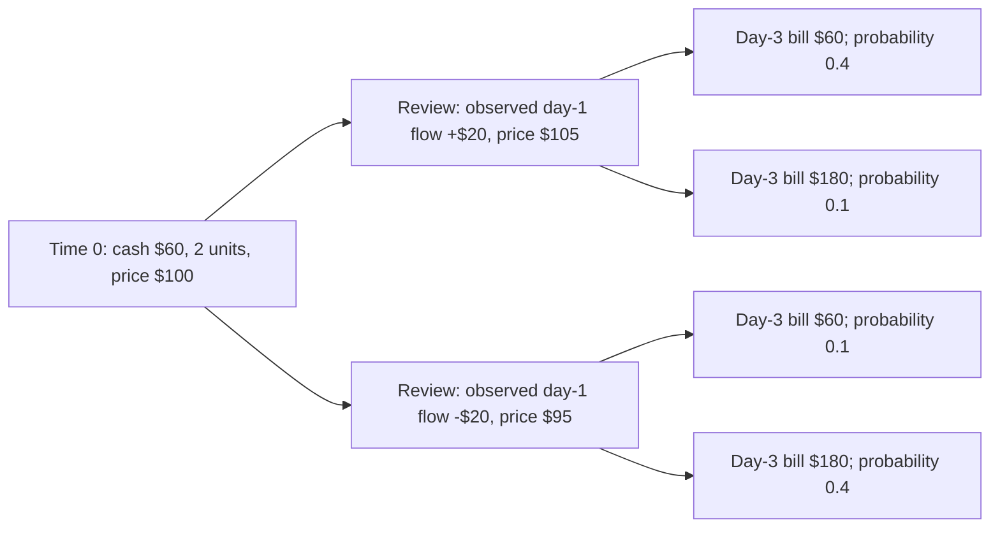

# Prompt C — Offline two-decision funding experiment

Implemented 20 September 2026 after A, B and their TUI integration. [Checkout audit](two-decision-audit.md). This is **`two-decision-grid-v1`**, a separate synthetic model. The existing single-decision optimizer, its dates, funding quotes, API recommendations, native kernels and precision estimator remain intact.

## What runs

`ginseng two-decision run` and **Quant Studio → Two-decision funding experiment** compare:

- **Static:** choose asset sale/credit amounts at time zero; no review action.
- **Nonanticipative:** choose one common time-zero action and a frozen action for each supported review observation group.
- **Hindsight:** the same common-root restriction, but review actions may inspect the entire future. This is an **infeasible diagnostic policy**, never a usable recommendation.

The TUI exposes the same engine, parameter recipes, comparison/stability tables, observed review states, daily ledger, trade prices, capture and replay. There is no exchange connection, personal-record ingestion, live execution or new web page.

## Model and information

The canonical fixture has $60 opening cash, two units of one asset priced at $100, a $100 credit facility, and decisions at time zero and **start of day 2**. Cash/price futures have four leaves:



Probabilities shown are unconditional. All leaves receive $100 income on the final modeled day, and end with an asset price of $100. Intermediate prices stay at the review quote until that final day. These are constructed examples of joint dependence, **not estimated market or household relationships**.

At review, the executor has cash flows realized through the preceding day, the current execution quote, available cash, remaining holdings, debt, and unsettled proceeds/reserved charges from its own earlier actions. The same-day cash flow is not yet observed. The policy class deliberately uses just two predeclared features: sign of cumulative realized cash flow, and current price below/not below today's price. Thus four groups are possible; two occur in the canonical tree. Multiple futures share each group and its action. No unique history identifiers enter an executable policy.

Groups absent from training use the predeclared **no-review-action** fallback. Observed net flow outside [-$100,$100] or price outside [0.5,1.5]×today's price also invokes it. This can produce poor outcomes; it is reported rather than refitted. `review_action` accepts only the observed-state contract and rejects hindsight policies. Tests change every unobserved cash flow and later price while keeping the observation fixed; the frozen review action stays unchanged.

This uses the information-grouping principle described by [Rockafellar and Wets (1991)](https://pubsonline.informs.org/doi/10.1287/moor.16.1.119), without implementing their policy-aggregation algorithm.

## Accounting, constraints and objective

Controls are integer sale units from zero through remaining holdings, and a draw of either zero or the facility limit. Root and review share one inventory and credit budget. There are no asset purchases, short sales, refinancing or later decision times. The model supports up to three units, four observation groups and 30 material days; the default action grid has six root controls and 18 feasible root/review pairs.

A sale executes at its decision-time price. Positive calendar-day settlement delay applies to both dates: default time-zero sales become available on day 2; day-2 sales on day 4. These explicit time-zero conventions do not alter the production one-indexed settlement helper. There is no business-day/holiday calendar in this experiment.

Default sale charges are $3 per nonzero order plus 2% of proceeds plus 20% of positive gains against $100/unit basis. Before settlement, gross receivables and their pending charges are tracked separately. On settlement, gross proceeds enter bank cash and charges become earmarked reserves. Available cash excludes those reserves. Charges are paid on the material-horizon final day, releasing the reserve without deducting them twice. These simplified synthetic fees/tax reserves are not an account-specific withdrawal quote or tax recommendation.

Credit becomes cash at execution less a $2 draw fee. The illustrative APR is 0.365 with simple daily accrual at APR/365. Day-zero debt first accrues on day 1; review-day debt accrues that day. All principal and accrued interest are paid on day 6 by default, even if that creates a cash failure. The visible horizon is four days, but material evaluation extends through repayment and both possible settlements. Terminal debt and unsettled proceeds are also included in wealth accounting and reported; supported runs finish with both cleared.

Daily ordering is:

1. Settle earlier sales and earmark their charges.
2. If this is the review day, observe the permitted state and execute the frozen action.
3. Apply that day's exogenous cash flow.
4. Accrue debt interest and, when due, repay principal and interest.
5. On the final material day, pay reserved charges.
6. Check **strictly negative end-of-day available cash**; equality is not failure and later recovery does not erase a failure.

The minimized objective, in dollars, is

```
E[passive terminal wealth − policy terminal wealth]
  + liquidity_charge × E[sum over days max(0, −available_cash)]
```

The default liquidity charge is $1 per dollar-day. It is an explicit penalty in the objective, not a second cash debit. Passive wealth includes the same exogenous cash flows and unsold starting holdings valued at the final price. Policy wealth includes bank cash, reserves, receivables net of charges, remaining holdings, outstanding principal and interest. Principal transfers are not treated as free income or an expense. A conservation residual checks wealth loss against explicit charges plus the opportunity cost of sold units. A flat-price, fee-free sale leaves wealth unchanged.

Cash nonnegativity is **not a hard constraint**: a budget-feasible policy can still fail the cash policy. Reports separate failures, expected negative-cash dollar-days, explicit cost, terminal wealth and the objective. The 95% empirical CVaR of maximum deficit uses existing weighted/tied-tail conventions as a **descriptive metric**. This release implements neither a precommitment CVaR objective nor a dynamically time-consistent CVaR formulation.

## Selection, reference and independent validation

For each root action, the expectation objective separates across review groups because there are no cross-scenario risk constraints. The selector enumerates every eligible review action in each group. It does not call or replace the production funding optimizer. The hindsight relaxation groups by complete-future content; its review rule is explicitly unusable without future information.

The static feasible set is contained in the nonanticipative set, which is contained in the common-root hindsight relaxation. Therefore, on the **same supplied training futures, weights, objective and grid**, the diagnostic minimum is ordered:

```
hindsight ≤ nonanticipative ≤ static
```

Enumeration reports candidate counts, numerical minima, selected objectives and selection gaps. Exact conditional ties choose lexicographically smallest sale/draw controls; root controls within $1e-9 of the minimum use the same declared order. This is numerical finite-grid evidence, not a continuous-control, unknown-population or real-world optimality certificate. A tiny independent `Fraction`-arithmetic reference enumerates the entire joint policy product instead of using the production conditional-selection decomposition. Other tests compare **every** default root/review action's cash path with an independent event-sum formula.

Training consists of iid categorical draws from the frozen four-leaf model. Repeated leaves are compressed into empirical frequencies; they are not discarded. PCG64/SeedSequence derivation reuses the existing helper with domain **720** for training and **721** for validation. Provenance checks verify derivations and disjoint stream namespaces, not different display labels or necessarily different realized leaves.

All predeclared training replications are fit and their policies frozen **before validation randomness is generated**. Replication zero is the selected policy by advance declaration; other replications diagnose action instability. All three selected policies use exactly the same independent validation ensemble. There is no holdout winner selection and no per-path holdout optimization. Even hindsight validation uses its already-frozen future-keyed lookup, with a no-action fallback for unseen futures; it is not recomputed as a holdout optimum. Its training lower bound does not guarantee frozen holdout ordering.

## Measured outcomes

[Full comparisons, stability and timings](../artifacts/two-decision/results.md), [raw measurements](../artifacts/two-decision/measurements.json), and [declared cases](../benchmarks/two-decision/config.json) are retained.

- **Canonical:** static and nonanticipative select two units sold now, no credit, and no review action. Both training and 4,096-draw validation objective are **$7.00**. Waiting adds no modeled value. The hindsight training diagnostic is **$6.328125**; its frozen validation value is **$6.224365**. Both usable policies observe zero validation cash failures; that does not prove zero future risk outside this model.
- **No fixed sale fee:** static validation objective is **$4.00**; nonanticipative is **$2.475684**, but its cash-failure estimate is **9.9121%**, versus zero for static. Lower objective is a cost/risk tradeoff under the declared penalty, not a safety improvement.
- **Four-day settlement:** nonanticipative validation objective is **$24.104492**, static **$24.204492**. Both fail cash on **48.9746%** of validation paths. Proceeds cannot rescue the earlier bill before settlement. This unfavorable case is retained.
- **Eight-draw training:** the ten nonanticipative fits select **two distinct root controls**. Reported policy/rule changes remain visible; validation does not choose among them. The separate flat-objective test accepts different optimal coefficients when objective and feasibility agree.

Normal computation measured **26.38 ms** warm median, capture **4.21 ms**, replay **29.15 ms**, with process high-water RSS about **128 MiB**. The separately labeled offline stress case uses 4,096 training draws, 32,768 validation draws and ten fits: **46.29 ms** computation, **19.55 ms** capture and **58.59 ms** replay, cumulative RSS about **136 MiB**. Both still contain only four unique futures; these results do not establish large-tree scalability. First-call and individual warm samples are published. Timings include preparation, sampling, selection, validation, ledger output and provenance; capture/replay are measured separately. Memory includes imported Python/native libraries and is not incremental allocation. Three warm runs are not a p99 estimate or a CI speed gate.

## Capture, replay and commands

The JSON-only artifact contains the exact finite cash/price support, empirical draw indices, weights, frozen policies for every training replication, observations, ledgers, trades, provenance and report. Input identity, output digest and overall integrity are separate. Captures publish atomically and reject existing destinations. Loading checks an 8 MiB bound, symlinks, schema/version, dimensions, content hashes, stream derivations and policy controls before evaluation. There is no pickle loading, network access or regenerated randomness during replay.

Replay recomputes all training/holdout summaries, training state/trade ledgers and replication summaries. It re-enumerates **training only** to compare objective and feasibility, allowing equivalent optimal plans rather than demanding a particular coefficient vector. Float comparisons use the existing strict numerical comparator; finite-grid objective equivalence has a $1e-8 absolute tolerance. A deliberately re-signed stale ledger is detected as a numerical mismatch, independently of byte-integrity checks. Source/dependency provenance is recorded; compatible source changes do not pretend to be byte-identical builds.

From the repository root:

```sh
.venv/bin/ginseng two-decision run --output /tmp/ginseng-two-decision
.venv/bin/ginseng two-decision replay /tmp/ginseng-two-decision
.venv/bin/ginseng two-decision replay examples/two-decision/canonical

.venv/bin/ginseng two-decision run --sale-fee 0 --output /tmp/ginseng-two-decision-no-fixed-fee
.venv/bin/ginseng two-decision run --settlement-days 4 --output /tmp/ginseng-two-decision-late
.venv/bin/ginseng two-decision run --training-paths 4096 --validation-paths 32768 --replications 10 --output /tmp/ginseng-two-decision-stress

OPENBLAS_NUM_THREADS=1 OMP_NUM_THREADS=1 MKL_NUM_THREADS=1 .venv/bin/python benchmarks/two-decision/measure.py
.venv/bin/pytest -q engine/tests/test_two_decision.py
.venv/bin/pytest -q engine/tests engine/ginseng/ginseng_rice/tests
.venv/bin/ginseng tui
```

Use a new capture directory each time. CLI exit codes are 0 for matching replay, 2 for invalid input/capture and 3 for numerical mismatch. Simulation policy failure is reported as an outcome, not confused with a replay failure. In the TUI, choose **Two-decision funding experiment**, edit the recipe and Run. `capture_path` is optional. **Replay two-decision experiment** opens the captured folder; its default is the committed synthetic example. Comparison, stability, review-node, trade and daily-ledger tables are selectable in Results; the full information contract and policies are in JSON. Existing notebook export/import works unchanged.

## Files and remaining limits

New modules: `two_decision.py`, `two_decision_artifact.py`, `two_decision_cli.py`; integration in `cli.py`, `studio.py` and `studio_ui.py`; independent tests in `test_two_decision.py`. Evidence lives in `benchmarks/two-decision`, `artifacts/two-decision` and `examples/two-decision`. No production optimizer/native code was changed.

This release intentionally remains a small synthetic model: one facility, one asset, coarse observations, fixed action grid, simple interest, synthetic charges, calendar-day settlement and one review. It does not learn a forecaster, integrate personal accounts/tax lots, test historical calibration, or establish economically optimal actions outside that finite model. No production deployment or real-world safety claim follows. Prompts A, B and C are now implemented at their stated separate scopes; no additional multi-stage or trading platform is inferred.

## Verification performed

The [full Python suite](../artifacts/two-decision/final-tests.txt) passed **559 tests and all 37 terminal snapshots** (70.72 seconds), with two existing dependency deprecations. Following the final immutable-policy ownership and report-validation hardening, all **17 Prompt C tests** passed again, including its real TUI subprocess run/capture/replay test; see [focused output](../artifacts/two-decision/focused-tests.txt). Tests cover independent full-product optimization and day arithmetic, information invariance, unavailable proceeds, reserves, late repayment, exact zero/recovery, capacity rejection, immutable inputs/policies, frozen untouched holdout, nonunique optima, zero-weight/unseen nodes, offline replay, corruption and re-signed stale ledgers. Static lint and `git diff --check` pass. No native source or web code changed, so native sanitizers and web builds were not rerun for C.
